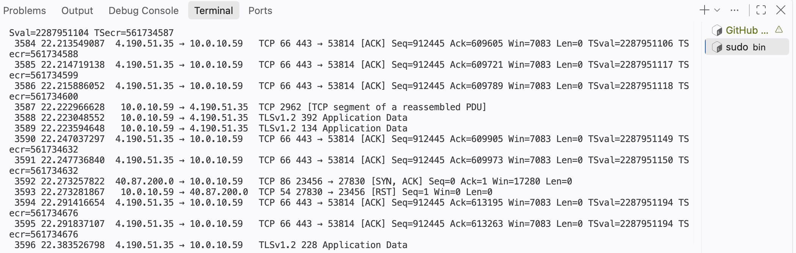

# forensics_Aug_2026

## Installation

### Update packages:

```
sudo apt update 
```
### Install TShark: 
```
sudo apt install tshark
```
### Configure permissions: 
Choose yes</inline> if prompted to allow non-superusers to capture packets, or 

```
sudo dpkg-reconfigure tshark-common

```
# Run Tshark

```
bin/tshark
```

# Output


